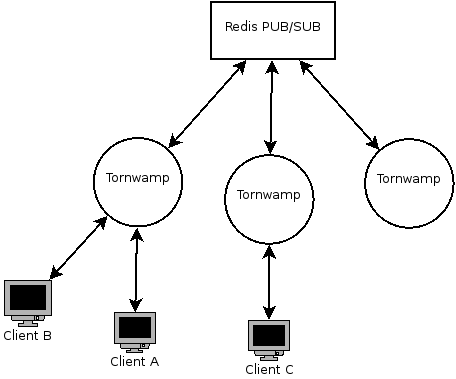

Multiple nodes deployment
=========================

The diagram (`created with dia <tornwamp-deployment.dia>`_) below shows
how a deployment of a server using tornwamp could look like. The redis
PUB/SUB is not required when a single server is deployed or if one
server does not need to know of the other.

When redis is used, whenever a message is published to a topic
(publishing to a WAMP topic is one of doing this, but not the only way)
in one of the servers, all the other servers also receive that message
and relay to clients connected in that topic.  Therefore, by default,
the client has no way to tell which server they are connected to. A
round-robin load balancer can be placed in front of such deployment
without problems.

In order to configure the redis server, the variable
tornwamp.topic.topics.redis must be set with a dict containing the port
and hostname. Eg.:

.. code-block:: json

    {"host": "example.com", "port": 6379}

The redis channels created have the same name as the WAMP topics (or any
topic created with tornwamp.topic.topics.create_topic)
